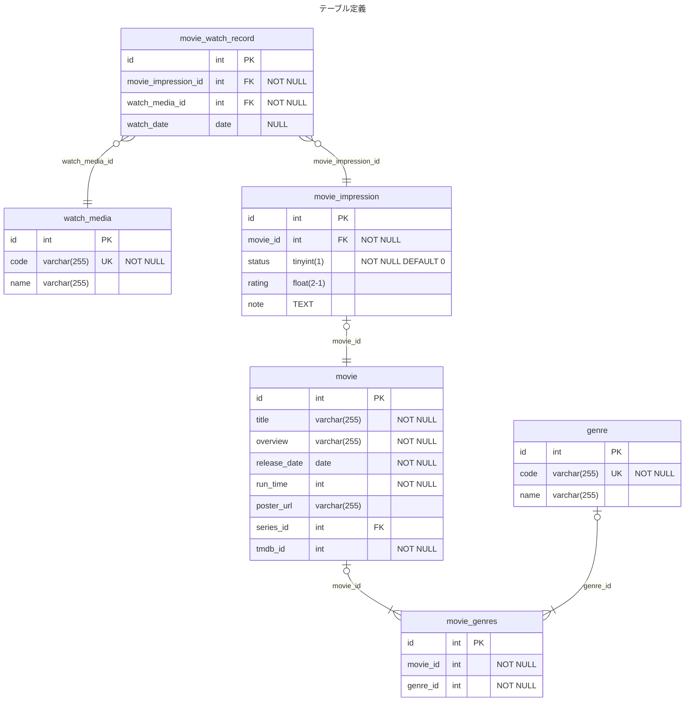

```mermaid
---
title: テーブル定義
---

erDiagram
    g[genre] {
        id   int          PK ""
        code varchar(255) UK "NOT NULL"
        name varchar(255)    ""
    }
    m[movie] {
        id           int          PK ""
        title        varchar(255)    "NOT NULL"
        overview     varchar(255)    "NOT NULL"
        release_date date            "NOT NULL"
        run_time     int             "NOT NULL"
        poster_url   varchar(255)    ""
        series_id    int          FK ""
        tmdb_id      int             "NOT NULL"
    }
    mg[movie_genres] {
        id       int PK ""
        movie_id int    "NOT NULL"
        genre_id int    "NOT NULL"
    }
    m o|--|{ mg: movie_id
    g o|--|{ mg: genre_id

    wm[watch_media] {
        id   int          PK ""
        code varchar(255) UK "NOT NULL"
        name varchar(255)    ""
    }
    mi[movie_impression] {
        id       int         PK ""
        movie_id int         FK "NOT NULL"
        status   tinyint(1)     "NOT NULL DEFAULT 0"
        rating   float(2-1)     ""
        note     TEXT           ""
    }
    mi o|--|| m: movie_id

    mwr[movie_watch_record] {
        id                  int   PK ""
        movie_impression_id int   FK "NOT NULL"
        watch_media_id      int   FK "NOT NULL"
        watch_date          date     "NULL"
    }
    mwr }o--|| mi: movie_impression_id
    mwr }o--|| wm: watch_media_id
```
