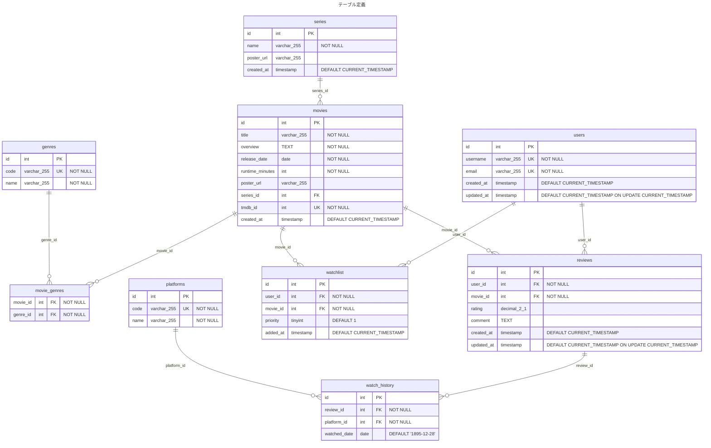

```mermaid
---
title: テーブル定義
---

erDiagram
    users {
        id          int PK
        username    varchar_255 UK  "NOT NULL"
        email       varchar_255 UK  "NOT NULL"
        created_at  timestamp       "DEFAULT CURRENT_TIMESTAMP"
        updated_at  timestamp       "DEFAULT CURRENT_TIMESTAMP ON UPDATE CURRENT_TIMESTAMP"
    }

    genres {
        id      int PK
        code    varchar_255 UK  "NOT NULL"
        name    varchar_255     "NOT NULL"
    }

    series {
        id          int PK
        name        varchar_255 "NOT NULL"
        poster_url  varchar_255
        created_at  timestamp   "DEFAULT CURRENT_TIMESTAMP"
    }

    movies {
        id              int         PK
        title           varchar_255     "NOT NULL"
        overview        TEXT            "NOT NULL"
        release_date    date            "NOT NULL"
        runtime_minutes int             "NOT NULL"
        poster_url      varchar_255
        series_id       int         FK
        tmdb_id         int         UK  "NOT NULL"
        created_at      timestamp       "DEFAULT CURRENT_TIMESTAMP"
    }

    movie_genres {
        movie_id int FK "NOT NULL"
        genre_id int FK "NOT NULL"
    }

    platforms {
        id      int         PK
        code    varchar_255 UK  "NOT NULL"
        name    varchar_255     "NOT NULL"
    }

    watchlist {
        id          int         PK
        user_id     int         FK  "NOT NULL"
        movie_id    int         FK  "NOT NULL"
        priority    tinyint         "DEFAULT 1"
        added_at    timestamp       "DEFAULT CURRENT_TIMESTAMP"
    }

    reviews {
        id          int         PK
        user_id     int         FK  "NOT NULL"
        movie_id    int         FK  "NOT NULL"
        rating      decimal_2_1
        comment     TEXT
        created_at  timestamp       "DEFAULT CURRENT_TIMESTAMP"
        updated_at  timestamp       "DEFAULT CURRENT_TIMESTAMP ON UPDATE CURRENT_TIMESTAMP"
    }

    watch_history {
        id              int         PK
        review_id       int         FK  "NOT NULL"
        platform_id     int         FK  "NOT NULL"
        watched_date    date            "DEFAULT '1895-12-28'"
    }

    users ||--o{ watchlist : user_id
    users ||--o{ reviews : user_id
    movies ||--o{ watchlist : movie_id
    movies ||--o{ reviews : movie_id
    movies ||--o{ movie_genres : movie_id
    genres ||--o{ movie_genres : genre_id
    series ||--o{ movies : series_id
    reviews ||--o{ watch_history : review_id
    platforms ||--o{ watch_history : platform_id

```
