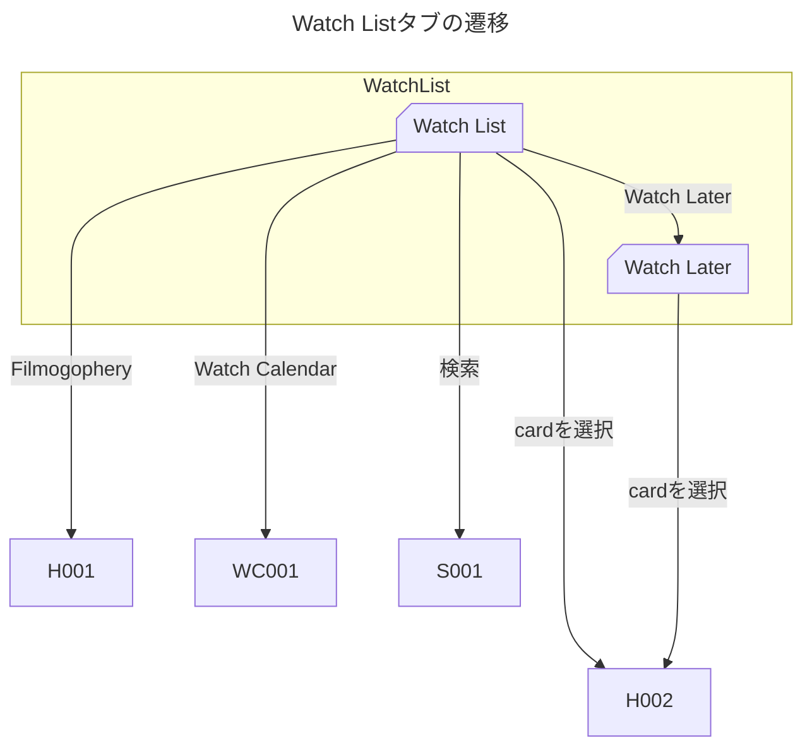

```mermaid
---
title: Watch Listタブの遷移
---

flowchart TB
    subgraph WatchList
        direction TB

        WL001@{shape: card, label: "Watch List"}
        WL002@{shape: card,label: "Watch Later"}

        WL001 -- Watch Later --> WL002
    end

    WL001 -- cardを選択 ----> H002
    WL002 -- cardを選択 ----> H002
    WL001 -- Filmogophery ----> H001
    WL001 -- Watch Calendar ----> WC001
    WL001 -- 検索 ----> S001
```
